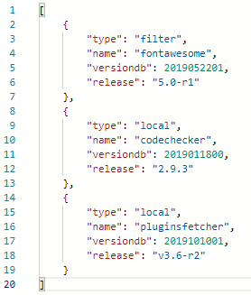

I'm one of these developers and I want to let you know a bit more about that.

My first own released plugin was a plugin which retries information about the installed plugins on a Moodle instance. Moodle differs between plugin types. My plugin is named `Plugins fetcher` and is a `web service` which is unfortunately missing in the Moodle core.

More information can be found under [https://moodle.org/plugins/local\_pluginsfetcher](https://moodle.org/plugins/local_pluginsfetcher).

Other contributions where I act as developer can be found under [https://moodle.org/plugins/browse.php?list=contributor\&id=2177440](https://moodle.org/plugins/browse.php?list=contributor\&id=2177440).

But that's not all, as you can see on my GitHub account ([https://github.com/adpe](https://github.com/adpe)) I also work for other open source plugins made for Moodle.

One project I forked and worked was part of my bachelor thesis. It's about integrating a 3rd party communication tool in to Moodle. More information can be found under the repos:

* [https://github.com/adpe/moodle-local\_rocketchat](https://github.com/adpe/moodle-local_rocketchat)
* [https://github.com/adpe/moodle-block\_rocketchat](https://github.com/adpe/moodle-block_rocketchat)
